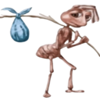

<h1 align="center"> Howdy pal! ℝ𝕒𝕗𝕚 𝔾𝕖𝕠𝕧𝕒𝕫𝕚 here, My 1st account got suspended, daz y this new one’s lame af</h1>

##  𝖠ᑲ𝗈υ𝗍 𝖬౿:
<table>
  <tr>
    <td align="left" valign="top" width="50%">
      <ul>
        ☝️🤓 𝚅̲𝚎̲𝚛̲𝚒̲𝚏̲𝚒̲𝚎̲𝚍̲ 𝙽̲𝚎̲𝚛̲𝚍̲ 
        <li>🤖 IoT-ML Aficionado 💻</li>
        <li>🚀 Science Junkie ||| Space Explorer 🔭</li>
        <li>🧬 BioTech ||| NeuroTechnology Enthusiast 🧠</li>
        <li>📺 Filmaholic ||| Music Geek 🎧</li>
        <li>🦇 Nocturnal</li>
        <li>🥷 Nonchalant</li>
         
        
      </ul>
    </td>
    <td align="right" valign="top" width="50%">
      
    </td>
  </tr>
</table>

##  ᔑoᥴɩⲁꙆ⳽:

  
  
  
  
  
  
  
  
  
  
  
   

## Ⲧⲉⲥⲏ Ⲋⲧⲁⲥⲕ:

                                      

##  Cσɳƚɾιᑲυƚισɳ⳽:

<picture>
  <source media="(prefers-color-scheme: dark)" srcset="https://raw.githubusercontent.com/rafigeovazi2/rafigeovazi2/output/pacman-contribution-graph-dark.svg">
  
</picture>

## ᘜɩtᖾᥙᑲ ᔑtⲁt⳽

 

 

## ᘜɩtᖾᥙᑲ Ʈɾoρᖾɩᥱ⳽

## ᖇⲁᥒᑯoຕ 𝖣౿𝗏 𝖰ᥙotᥱ  

##  Ʈoρ ᙅoᥒtɾɩᑲᥙtᥱᑯ ᖇᥱρo

## 𝖧౿ᥣρ ᑲɣ 𝖣𝗈𐓣ⲁ𝗍ɩᥒɠ (𝖨'ო 𝖡𝗋𝗈ƙ౿ ⲁｷ)

 

 

 

---
## 𝖪౿౿ρ ᔑɣɳⲁυ

## 𝙲𝚒ⲁσ.
